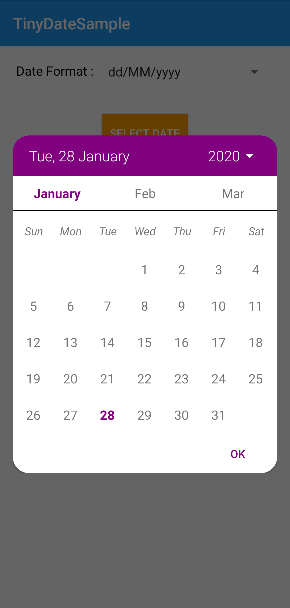
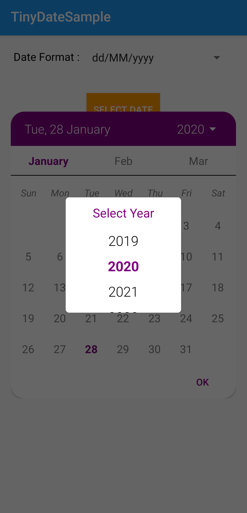
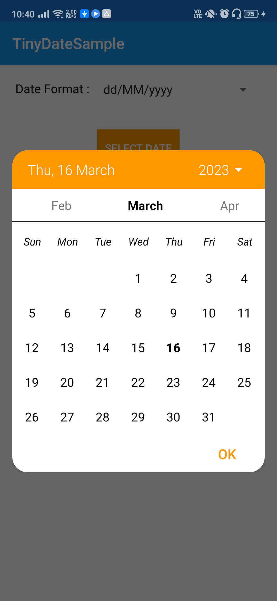
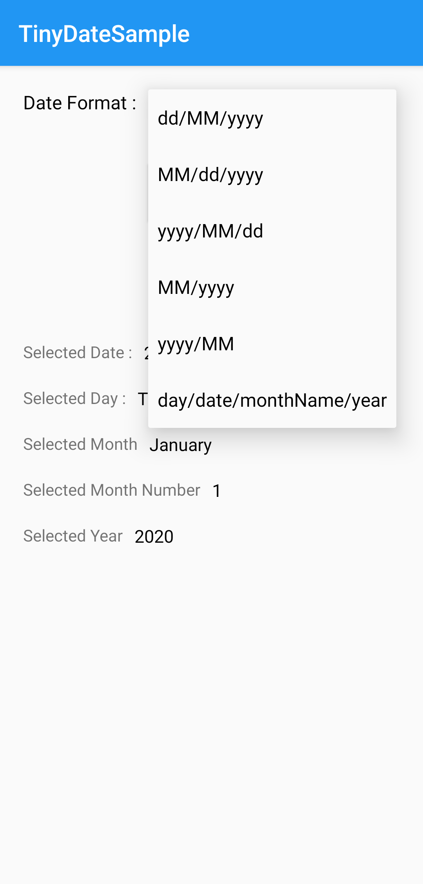
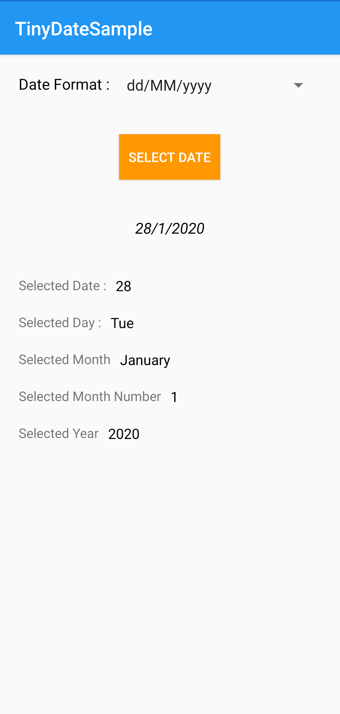
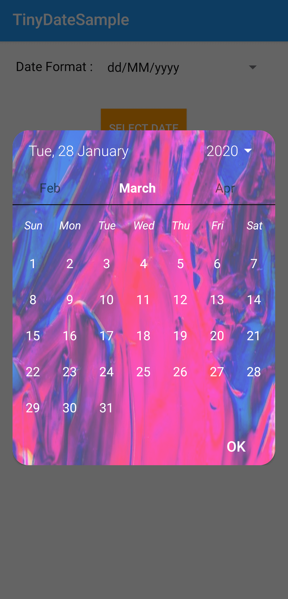
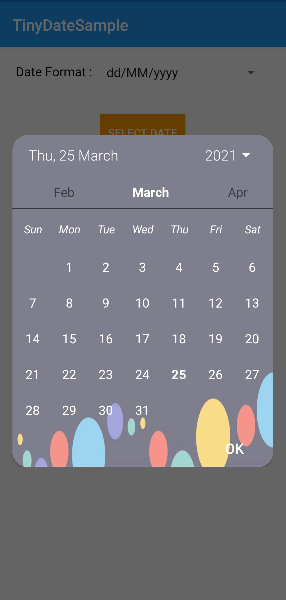

# TinyDateTime
This is a simple library for showing calendar which is highly customisable.

# Features

**1.** You can add background images to calendar dialog.<br>
**2.** You can also add alpha value(set visibility percentage) to the background image.<br>
**3.** You can also add background color instead of image to the calendar dialog.<br>
**4.** You can jump directly to a particular year.<br>
**5.** Nice way to select year.<br>
**6.** Comes with smooth animations.<br>
**7.** Written with documentations and proper code style, so any one can further customise the library according to their need.<br>
**8.** Added an example of how to use.<br>
**9.** You can also extract month, year or date independent to each other.<br>
**10.** You can also change the scaletype of background image.<br>

# Download and Import
#### Android Studio/Gradle
- JitPack.io, add jitpack.io repository and dependency to your build.gradle:
``` allprojects {
		repositories {
			...
			maven { url 'https://jitpack.io' }
		}
	}
   
  dependencies {
	        implementation 'com.github.harshbarnwal:TinyDateTime:1.0'
	}
```
   

# Usage
Instantiate the dialog as 
``` TinyDateDialog tinyDateDialog = new TinyDateDialog(this, this); ```
where first this is context and second this is **DateSelectedListener**.<br>
You can also create an anonymous implementation as
``` anonymous implementation of date listener
TinyDateDialog tinyDateDialog = new TinyDateDialog(this, new DateSelectedListener() {
            @Override
            public void onDateSelected(String date) {
                // do you stuff here
            }
        });
	tinyDateDialog.show(); // showing the date picker dialog
```
#### Adding Background Image
For adding background image do as below,
``` 
Bitmap bitmap = BitmapFactory.decodeResource(getResources(),
                R.drawable.img);    // creating bitmap image from drawable
tinyDateDialog
                .setCalendarImage(bitmap)    // pass the created bitmap
```
#### Setting Opacity(alpha) to Background Image
For setting the opacity of added background image in percentage do as below,
``` 
Bitmap bitmap = BitmapFactory.decodeResource(getResources(),
                R.drawable.img);    // creating bitmap image from drawable
tinyDateDialog
                .setCalendarImage(bitmap)    // pass the created bitmap
		.setImageAlpha(0.7f)    // for visibility percentage of image, 0.7 = 70%
```
#### Adding scaletype to background image
For changing scaletype of added background image do as below,
``` 
Bitmap bitmap = BitmapFactory.decodeResource(getResources(),
                R.drawable.img);    // creating bitmap image from drawable
tinyDateDialog
                .setCalendarImage(bitmap)    // pass the created bitmap
		.setImageScaleType(ImageView.ScaleType.FIT_XY)    // add the scaletype of your preference
```
#### Adding color to calendar dialog
If you want to add a color to the calendar instead of image do as below, (this will also change the ok button color to the selected color)
``` 
tinyDateDialog
                .setTabColor(getResources().getColor(R.color.orange)) // replace orange color with your preference color
```
#### Adding color to calendar's week text
For changing the text color of Weekends do as below,
``` 
tinyDateDialog
                .setWeekTextColor(getResources().getColor(R.color.black)) // replace black color with your preference color
```
#### Adding color to calendar's dates text
For changing the text color of the dates of the calendar do as below,
``` 
tinyDateDialog
                .setTextColor(getResources().getColor(R.color.white)) // replace white color with your preference color
```
#### Adding color to calendar's ok button color
For changing color of Ok button independent of calendar's color do as below,
``` 
tinyDateDialog
                .setOkButtonColor(getResources().getColor(R.color.purple)) // replace purple color with your preference color
```
#### Changing the date format
For changing the returned date format to other available date formats just pass the other format from available enum to TinyDateDialog as shown below,
``` 
tinyDateDialog
                .setDateFormat(TinyDateDialog.MonthFormats.dd_MM_yyyy) // replace dd_MM_yyyy with available enums of MothsFormats
```
#### Fetch Selected Day
This Method returns day of selected date as the String,
``` 
tinyDateDialog
                .getSelectedDay() // returns selected day as string
```
#### Fetch Selected Date
This Method returns date of selected date as the Integer(int),
``` 
tinyDateDialog
                .getSelectedDate() // returns selected date as int
```
#### Fetch Selected Month name
This Method returns name of selected month as String,
``` 
tinyDateDialog
                .getSelectedMonthName() // returns selected month name as string
```
#### Fetch Selected Month number
This Method returns month number of selected date as Integer(int),
``` 
tinyDateDialog
                .getSelectedMonthNumber() // returns selected month number as int
```
#### Fetch Selected Year
This Method returns selected year as Integer(int),
``` 
tinyDateDialog
                .getSelectedYear() // returns selected year as int
```

# Screenshots
 
 
 

